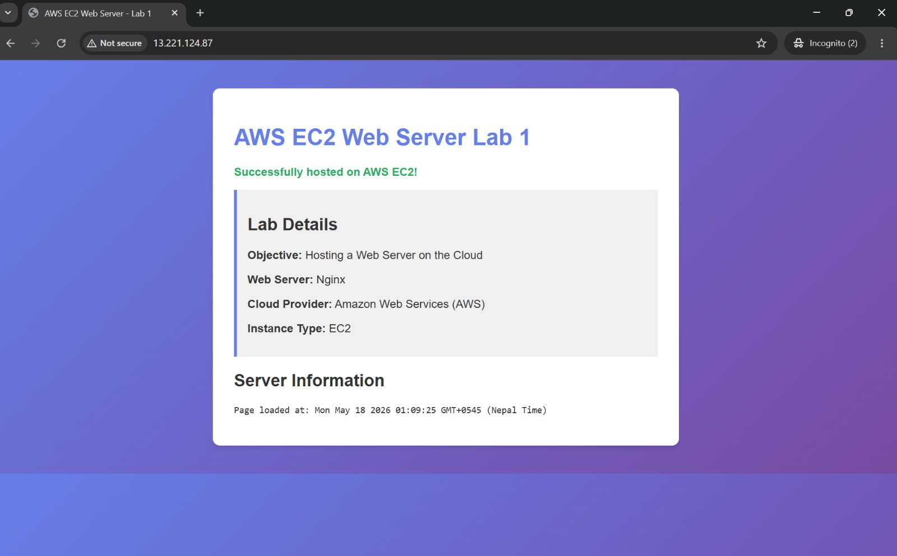
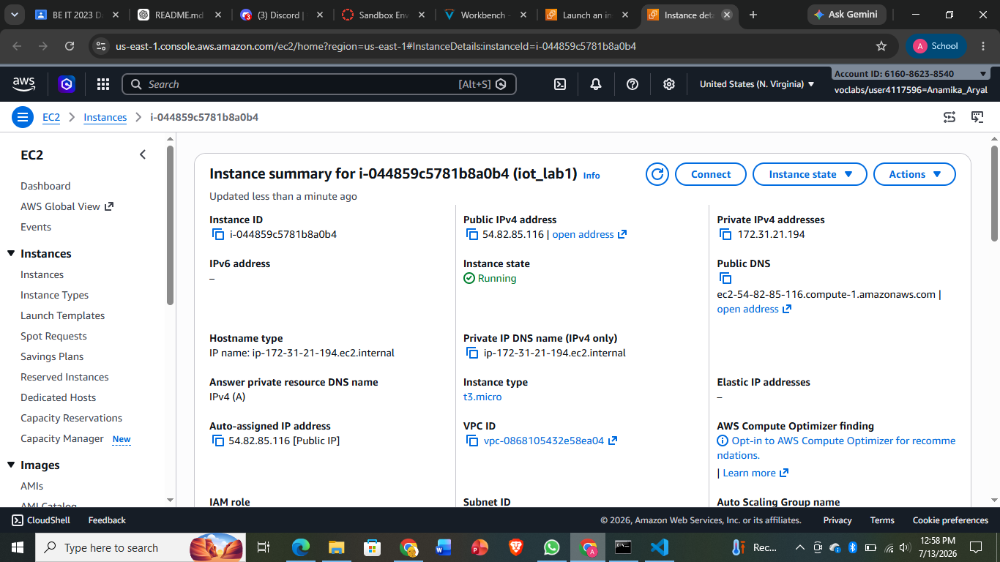
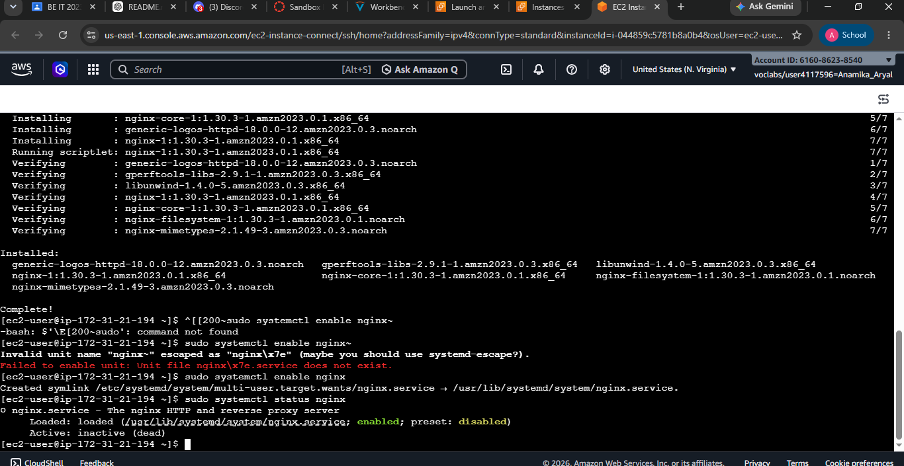
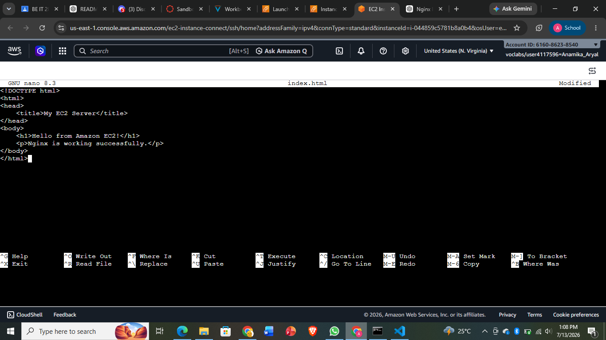

# AWS EC2 Web Server Lab 1

## Overview

This lab demonstrates how to deploy a simple web server on Amazon EC2. The objective is to launch an EC2 instance, connect to it using SSH, install the Apache web server, and host a basic HTML webpage.

---

## Objectives

- Launch an EC2 instance on AWS.
- Connect to the instance using SSH.
- Install Apache2 Web Server.
- Modify the default webpage.
- Verify the hosted website using the EC2 Public IP.

---

## Technologies Used

- Amazon Web Services (AWS)
- Amazon EC2
- Ubuntu Server
- Apache2
- Linux Terminal
- HTML

---

## Prerequisites

- AWS Account
- EC2 Key Pair (.pem file)
- Security Group allowing:
  - SSH (Port 22)
  - HTTP (Port 80)

---

## Steps Performed

### 1. Launch EC2 Instance

- Open AWS Management Console.
- Navigate to **EC2 Dashboard**.
- Launch a new Ubuntu instance.
- Select an appropriate instance type (t2.micro).
- Configure Security Groups:
  - SSH (22)
  - HTTP (80)

---

### 2. Connect to EC2 via SSH

```bash
chmod 400 aws.pem

ssh -i aws.pem ubuntu@<Public-IP>
```

---

### 3. Update Package Repository

```bash
sudo apt update
```

---

### 4. Install Apache Web Server

```bash
sudo apt install apache2 -y
```

---

### 5. Navigate to Web Directory

```bash
cd /var/www/html
```

---

### 6. Backup Existing Webpage

```bash
sudo mv index.html index.html.save
```

---

### 7. Create New HTML Page

```bash
sudo nano index.html
```

Example HTML:

```html
<!DOCTYPE html>
<html>
<head>
    <title>AWS EC2 Web Server Lab</title>
</head>
<body>
    <h1>Successfully Hosted on AWS EC2</h1>
</body>
</html>
```

Save the file.

---

### 8. Verify Apache Status

```bash
sudo systemctl status apache2
```

---

### 9. Access the Website

Open a browser and visit:

```
http://54.82.85.116
```

The webpage should display:


```
Successfully Hosted on AWS EC2
```

---

## Project Structure

```
AWS-EC2-WebServer-Lab/
│
├── README.md
├── index.html
└── screenshots/
    ├── ec2-dashboard.png
    ├── instance-details.png
    ├── terminal-commands.png
    └── webpage-output.png
```

---




---

## Commands Used

```bash
sudo apt update

sudo apt install apache2 -y

cd /var/www/html

ls

sudo mv index.html index.html.save

sudo nano index.html
```

---

## Output

The Apache web server was successfully installed on the EC2 instance, and the custom HTML webpage was accessible through the instance's public IP address.

---

## Learning Outcomes

After completing this lab, I learned how to:

- Launch an EC2 instance.
- Configure Security Groups.
- Connect to a Linux server using SSH.
- Install and manage Apache Web Server.
- Host a static website on AWS.
- Access hosted content using a public IP address.

---

**Anamika Aryal**