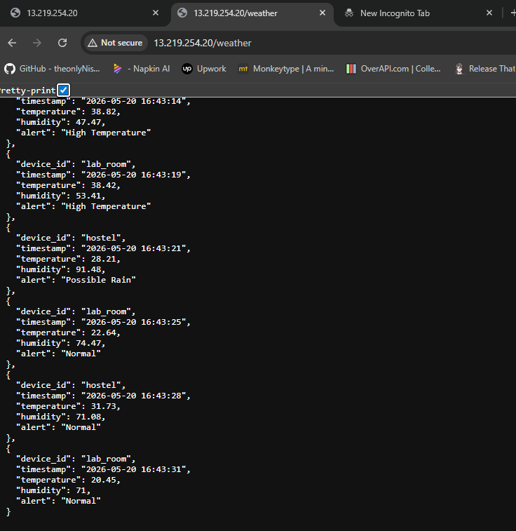
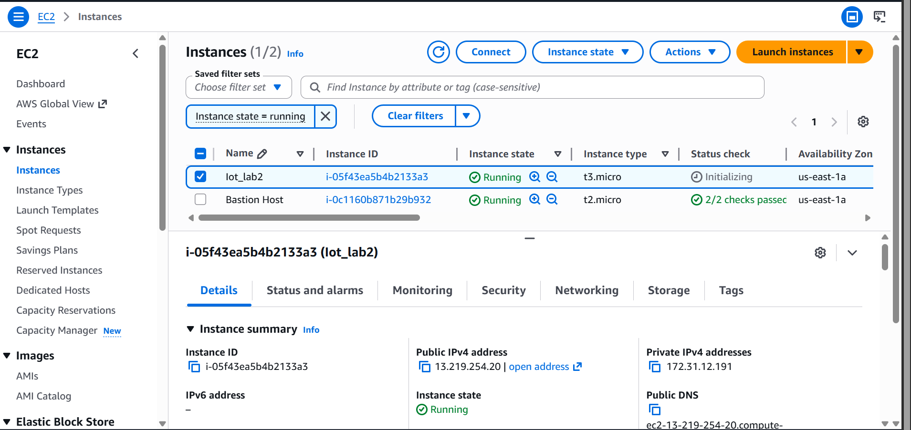

## Lab 2: Developing and deploying a REST API to store data on cloud
---

### Objectives
1. Launch and configure an AWS EC2 instance
2. Create a Python virtual environment (venv)
3. Install FastAPI, Uvicorn, and TinyDB
4. Develop REST API endpoints using FastAPI
5. Store temperature and humidity data with timestamps
6. Test GET and POST API endpoints
   ---
### Background Theory
- Cloud computing in IoT systems
- AWS EC2 (Elastic Compute Cloud)
- REST API architecture
- FastAPI framework
- TinyDB database
- HTTP GET and POST methods
  ---
### Procedure
1. Launch EC2 Instance
   - Log in to AWS Management Console.
   - Launch an EC2 instance (Ubuntu recommended).
   - Configure security group to allow:
     - SSH (port 22)
     - HTTP (port 80)
     - Custom TCP (port 8000 for FastAPI)
  2. Connect to EC2
  3. Update System and Install Python
  4. Create Virtual Environment
  5. Install required Libraries
  6. Create FastAPI Application (main.py)
  7. Run the Application
---
### Output
- API successfully deployed on AWS EC2 instance.
- Temperature and humidity data stored in TinyDB database.
- GET request returns all stored sensor records in JSON format.
- POST request successfully inserts new IoT data entries with timestamps.
---
### Screenshots 

---
### Conclusion
In this lab, a REST API was successfully developed using FastAPI and deployed on an AWS EC2 instance. 
The API was able to store and retrieve IoT sensor data (temperature and humidity) using TinyDB. This 
demonstrates how cloud computing can be effectively used for real-time IoT data collection and management
using lightweight web frameworks.

---