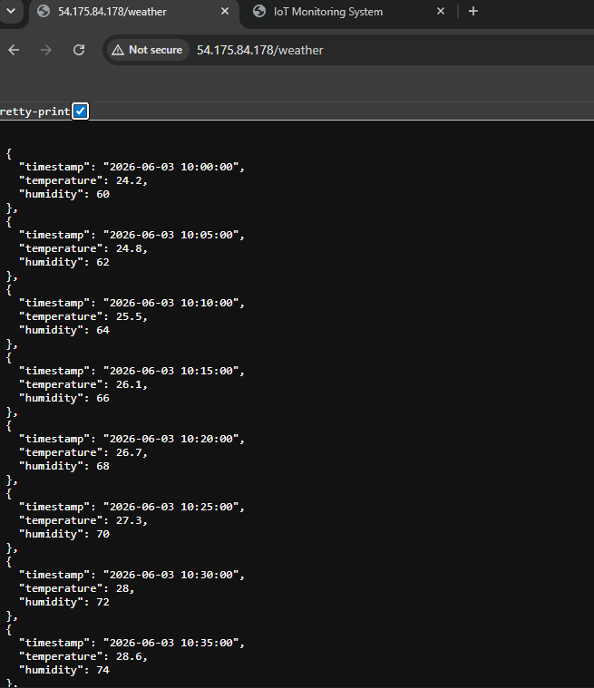
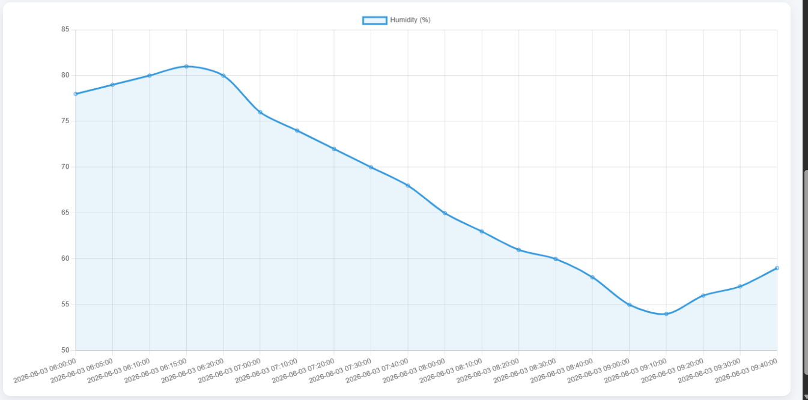
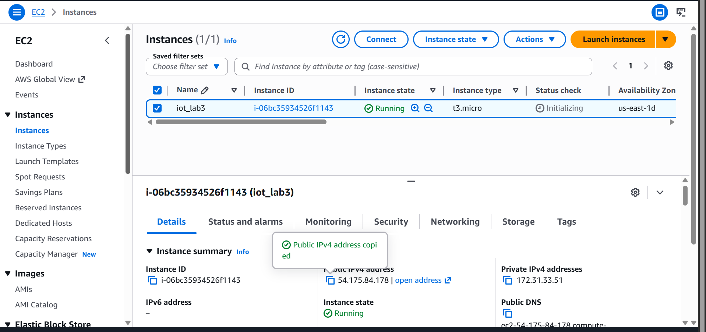
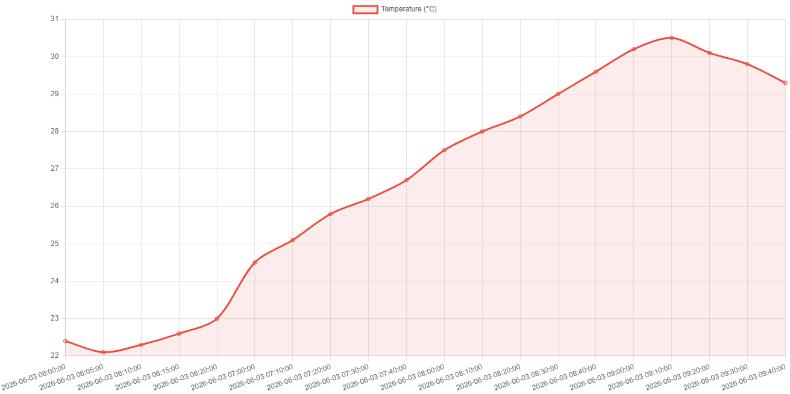

## Lab 3
---
### Title: Visualizing IoT Sensor Data Using Interactive Dashboards
---
### Objectives:
 1. Retrieve stored sensor data from the REST API developed in Lab 2.
 2. Understand the importance of data visualization in IoT systems.
 3. Develop a web-based dashboard to display sensor data.
 4. Create real-time and historical visualizations of temperature and humidity data.
 5. Deploy the dashboard on the AWS EC2 instance.
 6. Analyze sensor trends using graphical representations.
 ---
### Background Theory
- Data Visualization in IoT
- API Oriented Architecture
- Dashboard Systems
- Designing Data Filters
---
### Procedure 
- Ensure the REST API developed in Lab 2 is running on the AWS EC2 instance.
- Retrieve temperature and humidity data using the API's GET endpoint.
- Install the required Python libraries (e.g., Streamlit, Pandas, Requests, Plotly).
- Create a dashboard application that fetches data from the API.
- Convert the received JSON data into a Pandas DataFrame.
- Display the sensor data in tabular format.
- Create line charts for temperature and humidity values over time.
- Add filtering options for selecting specific date and time ranges.
- Enable automatic refresh to display near real-time sensor updates.
- Test the dashboard locally and verify data visualization.
- Deploy the dashboard on the AWS EC2 instance.
- Access the dashboard through a web browser and analyze the displayed trends.
---
### Output
- Successful retrieval of sensor data from the REST API.
- Interactive dashboard displaying temperature and humidity readings.
- Real-time updates of sensor values.
- Historical data visualization using line graphs.
- Filtered views based on selected date and time ranges.
- Dashboard successfully hosted and accessible through the AWS EC2 public IP address.
- Improved understanding of environmental trends through graphical analysis
---
### ScreenShots 

---
### Conclusion
- Sensor data stored in the cloud was successfully retrieved through REST API endpoints.
- An interactive dashboard was developed to visualize temperature and humidity data effectively.
- Real-time and historical data monitoring improved the understanding of sensor behavior.
- Graphical representations helped identify trends and patterns in IoT data.
- Deployment on AWS EC2 demonstrated cloud-based visualization capabilities.
- The experiment highlighted the importance of dashboards in IoT monitoring and decision-making systems.
---