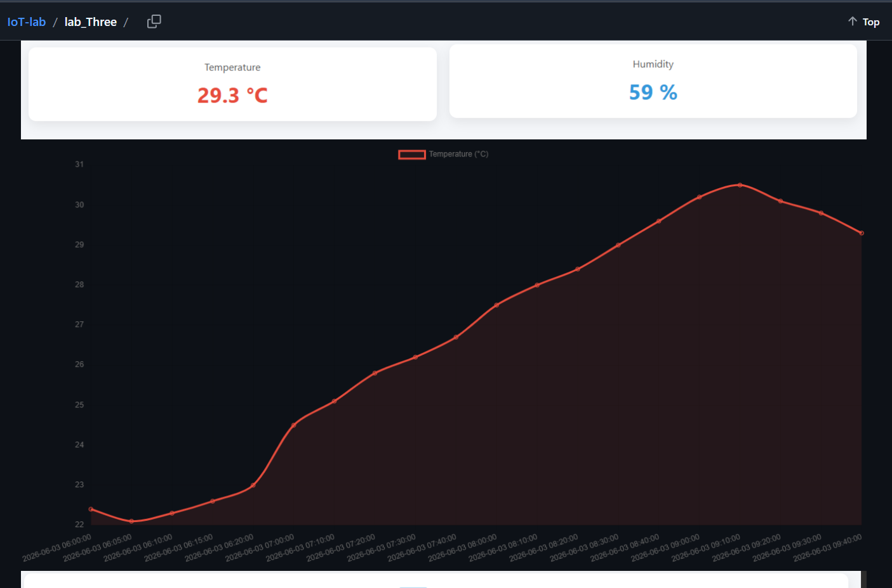
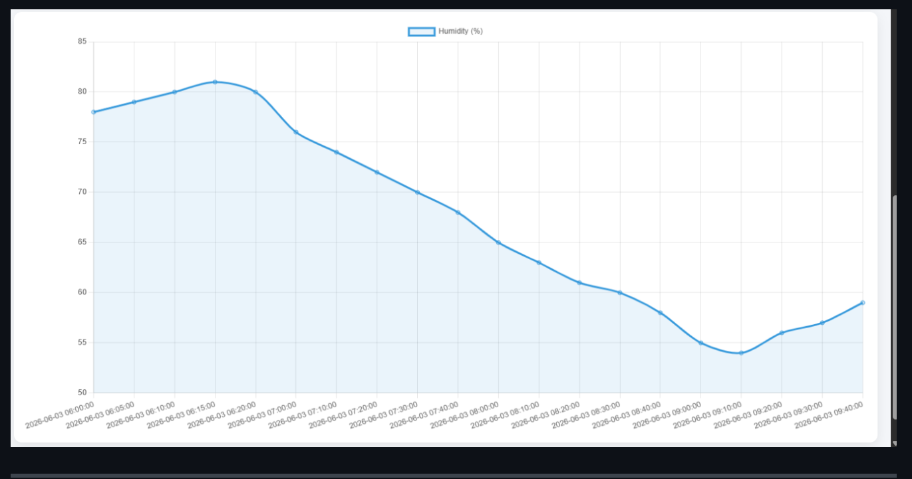

# Lab 5: Integrating ESP32 Sensor Data with Cloud-Based REST API and Dashboard Visualization

## 1. Objective

The objective of this experiment is to interface a DHT22 temperature and humidity sensor with an ESP32 development board, transmit the collected sensor data to a cloud-hosted REST API deployed on an AWS EC2 instance, store the data in a cloud database, and visualize both real-time and historical sensor readings through a web dashboard.

## 2. Background Theory

### 2.1 ESP32 Microcontroller

The ESP32 is a low-cost, low-power microcontroller developed by Espressif Systems. It features:

- Built-in Wi-Fi and Bluetooth
- Dual-core processor
- Multiple GPIO pins
- Support for HTTP, MQTT, I2C, SPI, UART, and ADC

Its integrated Wi-Fi capability makes it an ideal platform for Internet of Things (IoT) applications.

### 2.2 DHT22 Temperature and Humidity Sensor

The DHT22 (AM2302) is a digital temperature and humidity sensor that provides:

- High accuracy
- Wide measurement range
- Stable digital output

The sensor communicates with the ESP32 through a single-wire digital communication protocol.

### 2.3 REST API

Representational State Transfer (REST) is a standard architecture for communication between clients and servers over HTTP.

In this experiment:

- ESP32 acts as the client.
- AWS EC2 hosts the REST API.
- Sensor readings are uploaded using **HTTP POST** requests.
- Stored data is retrieved using **HTTP GET** requests.

### 2.4 IoT Data Flow

The complete IoT workflow is shown below.

```text
DHT22 Sensor
      │
      ▼
    ESP32
      │
      ▼
 Wi-Fi Network
      │
      ▼
 REST API (AWS EC2)
      │
      ▼
 Cloud Database
      │
      ▼
 Dashboard
```

## 3. Components Required

| Component | Quantity |
|-----------|---------:|
| ESP32 Development Board | 1 |
| DHT22 Sensor | 1 |
| Breadboard | 1 |
| Jumper Wires | As Required |
| Micro USB Cable | 1 |
| Arduino IDE | Installed |
| AWS EC2 REST API | Running |
| Dashboard | Developed in Lab 3 |

## 4. Circuit Connection

The DHT22 sensor is connected to the ESP32 using GPIO4.

| DHT22 Pin | ESP32 Pin |
|-----------|-----------|
| VCC | 3.3V |
| DATA | GPIO4 |
| GND | GND |

### Circuit Diagram

<figure align="center">
  
  <figcaption><b>Figure 1.</b> Sensor Connection</figcaption>
</figure>


## 5. Procedure

1. Connect the DHT22 sensor to the ESP32.
2. Install the required Arduino libraries.
3. Upload the ESP32 program.
4. Verify the sensor readings using the Serial Monitor.
5. Connect the ESP32 to the Wi-Fi network.
6. Configure the REST API endpoint.
7. Send the sensor readings to the AWS EC2 REST API.
8. Verify that the readings are stored in the cloud database.
9. Open the dashboard.
10. Observe the real-time and historical sensor data.

## 6. ESP32 Program

```cpp

#include <WiFi.h>
#include <HTTPClient.h>
#include <DHT.h>

#define DHTPIN 4
#define DHTTYPE DHT22

DHT dht(DHTPIN, DHTTYPE);

const char* ssid = "Suraj";
const char* password = "suraj@123312";

const char* serverUrl = "http://100.48.81.73/weather/sensor-data";

void setup() {

    Serial.begin(115200);

    dht.begin();

    WiFi.begin(ssid, password);

    while (WiFi.status() != WL_CONNECTED) {
        delay(500);
    }

    Serial.println("WiFi Connected");
}

void loop() {

    float temperature = dht.readTemperature();
    float humidity = dht.readHumidity();

    if (!isnan(temperature) && !isnan(humidity)) {

        if (WiFi.status() == WL_CONNECTED) {

            HTTPClient http;

            http.begin(serverUrl);

            http.addHeader("Content-Type", "application/json");

            String payload =
                "{\"temperature\":"
                + String(temperature)
                + ",\"humidity\":"
                + String(humidity)
                + "}";

            http.POST(payload);

            http.end();
        }

        Serial.print("Temperature: ");
        Serial.println(temperature);

        Serial.print("Humidity: ");
        Serial.println(humidity);
    }

    delay(10000);
}

```


## 7. Experimental Results

### 7.1 Serial Monitor Output

The ESP32 successfully acquires temperature and humidity values from the DHT22 sensor.

<div align="center">
  
  <br>
  <em>Figure 2: Data Output on Serial Monitor</em>
</div> 

### 7.2 Temperature Dashboard

The dashboard displays the temperature values received from the REST API.

<p align="center">
  
  <br>
  <em>Figure 3: Temperature Dashboard</em>
</p>

### 7.3 Humidity Dashboard

The dashboard displays the humidity values stored in the cloud database.

<p align="center">
  
  <br>
  <em>Figure 4: Humidity Dashboard</em>
</p>
## 8. Results

The experiment successfully demonstrates:

- Successful interfacing of the DHT22 sensor with ESP32.
- Accurate acquisition of temperature and humidity readings.
- Wi-Fi communication using ESP32.
- Uploading sensor data to the AWS EC2 REST API.
- Storage of readings in the cloud database.
- Retrieval of stored readings through the REST API.
- Real-time dashboard visualization.
- Historical trend analysis of temperature and humidity.

## 9. Learning Outcomes

After completing this experiment, students are able to:

- Interface digital sensors with ESP32.
- Read environmental data from the DHT22 sensor.
- Use HTTP POST and GET requests.
- Send JSON data to a cloud REST API.
- Store IoT data in a cloud database.
- Visualize sensor data using a web dashboard.
- Understand the complete IoT data pipeline.

## 10. Conclusion

This experiment successfully demonstrates a complete Internet of Things (IoT) pipeline. The ESP32 collects temperature and humidity data from the DHT22 sensor, transmits it over Wi-Fi to a REST API hosted on an AWS EC2 instance, stores the readings in a cloud database, and visualizes both real-time and historical data through an interactive dashboard. The implementation validates reliable end-to-end communication between an embedded device and cloud services.

## 11. Workflow

```css
Read Sensor Data
        │
        ▼
ESP32 Processing
        │
        ▼
Wi-Fi Connection
        │
        ▼
HTTP POST Request
        │
        ▼
AWS EC2 REST API
        │
        ▼
Cloud Database
        │
        ▼
HTTP GET Request
        │
        ▼
Dashboard Visualization
```